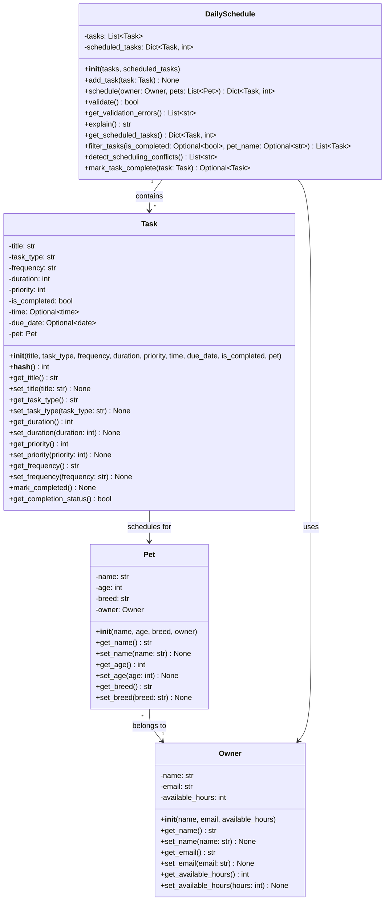

# PawPal+ UML Class Diagram (Updated)

## Key Updates from Original UML

### Task Class Enhancements
- **Added attributes:**
  - `time: Optional[time]` — preferred task start time for scheduling
  - `due_date: Optional[date]` — task due date for recurring task tracking
  
- **Added methods:**
  - `__hash__()` — makes Task hashable for use as dictionary key in scheduled_tasks

### DailySchedule Class Enhancements
- **New methods:**
  - `add_task(task: Task)` — adds task to schedule (core operation)
  - `filter_tasks(is_completed, pet_name)` — filter tasks by completion status and/or pet name
  - `detect_scheduling_conflicts()` — returns list of conflict warnings for overlapping tasks
  - `mark_task_complete(task: Task)` — marks task complete and creates next occurrence for recurring tasks
  - `get_validation_errors()` — returns detailed list of validation errors instead of just boolean
  
- **Updated methods:**
  - `validate()` — now uses get_validation_errors() internally

## Architecture

**Relationships:**
- Pet has a 1:1 relationship with Owner (many pets can belong to one owner)
- DailySchedule contains many Tasks (1:*)
- Task is associated with one Pet
- DailySchedule uses Owner's available_hours for constraint-based scheduling

**Key Features Supported:**
- Multi-tier sorting (time, frequency, priority)
- Recurring task management (daily/weekly auto-recurrence)
- Conflict detection (same-time and same-pet conflicts)
- Task filtering (by status and pet)
- Schedule validation (critical tasks checking)
- Constraint-based optimization (respects available hours)
